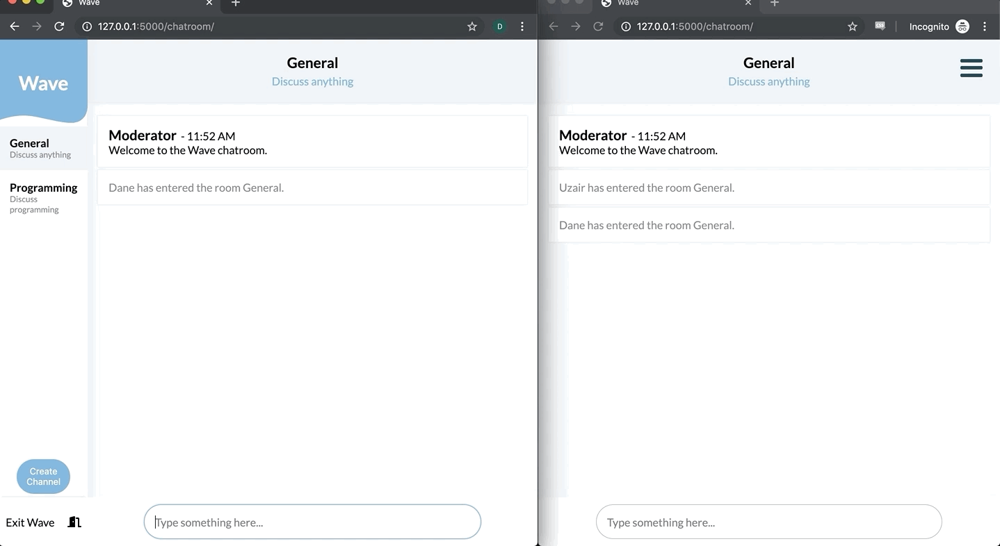

# Wave

🌊
A full-stack chatroom application.

# Technologies used

* JavaScript
* Socket.IO
* Python
* Flask
* jQuery
* CSS 3
* HTML 5
* Heroku

# Live Demo

Try the application live at: https://wave-chat.herokuapp.com

Use whatever username you'd like to sign in!
No password required.

# Features

* User can join the chatroom with a specific username
* User can send and recieve messages in real-time
* User can join different channels
* User can create different channels
* User can exit the browser and return back to the same channel with the same username without having to log back in
* User can exit/sign out of the application

# Preview



# Development

#### System Requirements

* Python 3
* pip
* virtualenv

#### Getting Started

1. Clone the repository.

  ```
  git clone https://github.com/danemaison/wave.git
  cd wave
  ```

1. Create and activate a new virtual environment

  ```
  python 3 -m venv env
  source env/bin/activate
  ```

1. Install the requirements with pip

  ```
  pip install -r requirements.txt
  ```

1. Set the environment variable `FLASK_APP` equal to `application.py`

  Mac
  ```
  export FLASK_APP=application.py
  ```

  Windows
  ```
  set FLASK_APP=application.py
  ```

1. Start the application with flask
  `flask run`

1. Navigate to `http://127.0.0.1:5000` in your browser
